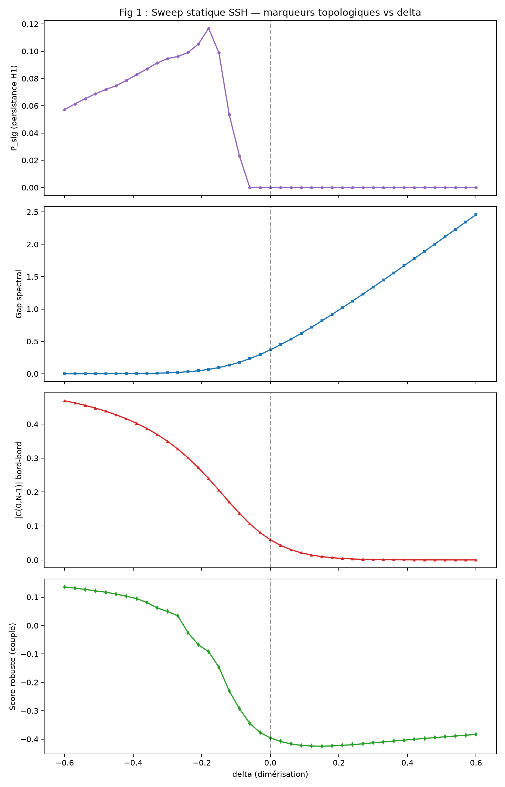
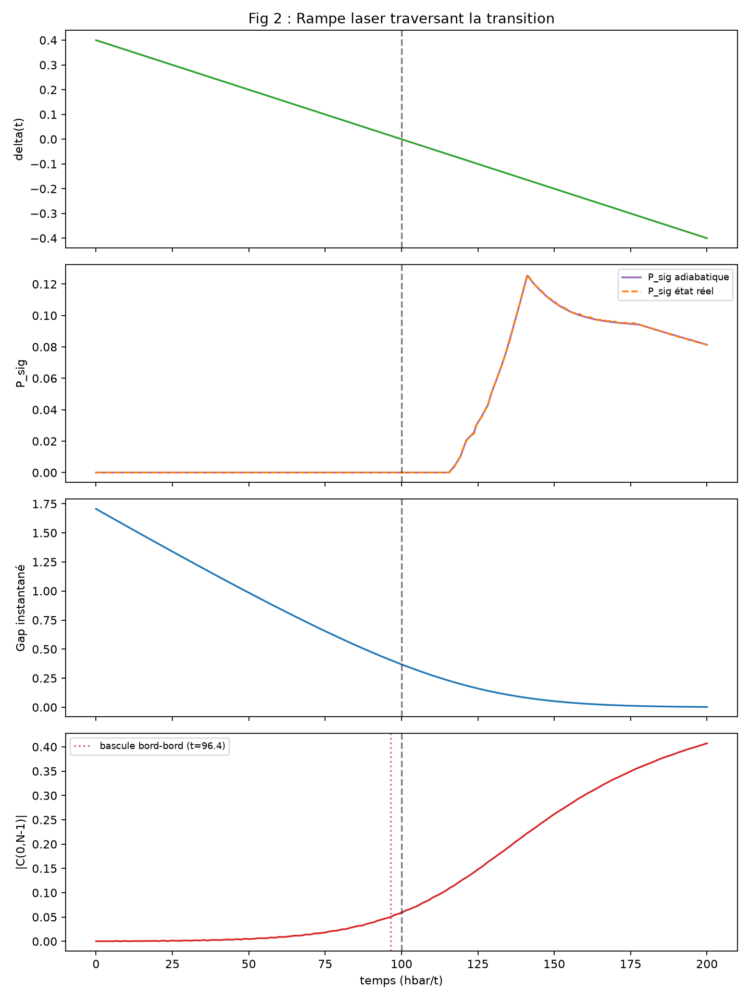
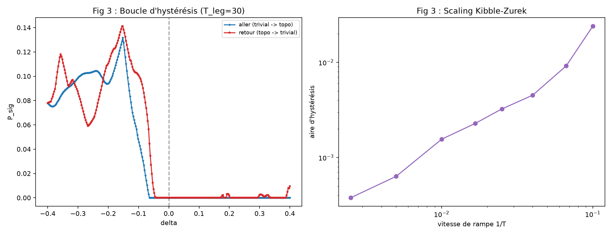
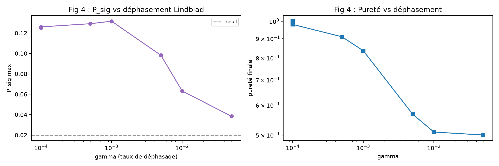
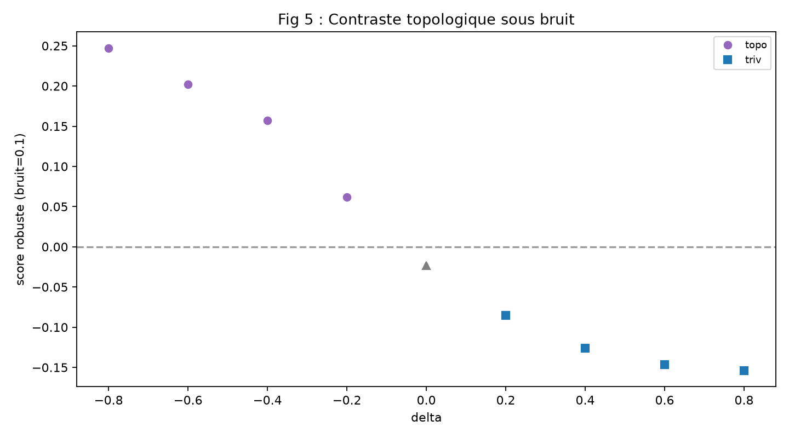
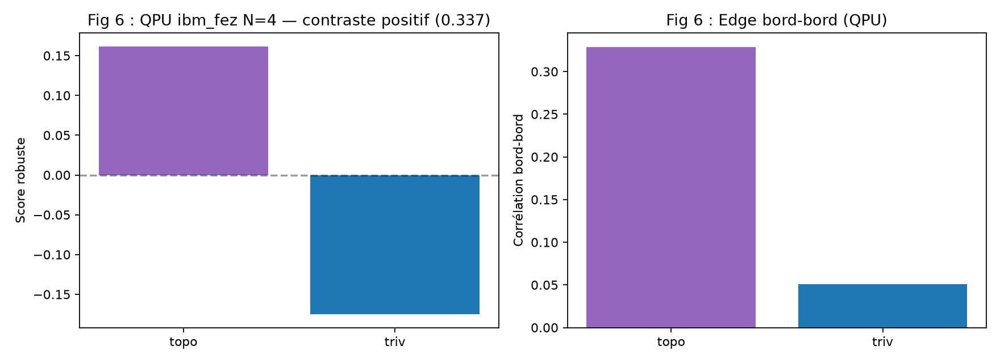
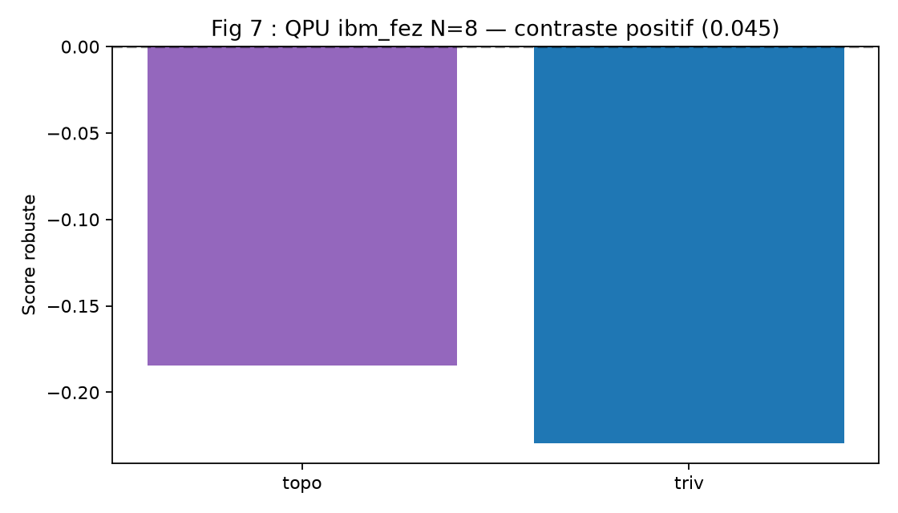

# RATISS Photoinduced Topology — Documentation Technique Ultra-Complète

**Auteurs :** Jonathan Evina ([ORCID 0009-0000-4092-5313](https://orcid.org/0009-0000-4092-5313)) & JOHNKING0
**Repo :** [evinajonathan13-max/Travaux](https://github.com/evinajonathan13-max/Travaux)

---

## Table des métriques

| Métrique | Formule | Rôle | Robustesse bruit |
|---|---|---|---|
| P_sig | Persistance H1 Vietoris-Rips | Détecteur binaire phase topologique | Faible seul |
| Edge | \|C(0,N-1)\| corrélation bord-bord | Alerte précoce phase topologique | Forte physique |
| Gap | Gap spectral instantané | Marqueur classique phase | Faible à taille finie |
| Score robuste | psig_seuillé + edge - 0.1×entropie | Vote combiné, robuste au bruit | **Forte validée QPU** |
| Entropie | -sum(\|C\|·log\|C\|) corrélation | Pénalise le désordre | Auxiliaire |

**Contraste validé sur QPU ibm_fez (N=4 : 0.337, N=8 : 0.045).**

---

## Les 7 figures

### Fig 1 — Sweep statique SSH (simulation analytique)


**Ce qu on voit :** P_sig strictement nul dans la phase triviale (delta>0),
non nul dans la phase topologique (delta<0) — détecteur binaire parfait.
Corrélation bord-bord monte en précurseur avant delta=0. Score robuste
positif en phase topologique, négatif en phase triviale.

**Vérité analytique :** transition exacte à delta=0 (winding number,
modèle SSH soluble).

### Fig 2 — Rampe laser pilotée (simulation temps réel)


**Ce qu on voit :** La corrélation bord-bord **bascule à t=96.4, soit 3.6
unités de temps AVANT** que le Hamiltonien n atteigne delta=0 (t=100).
C est le signal d alerte précoce topologique. P_sig adiabatique et P_sig
état réel suivent exactement (suivi quasi-adiabatique).

**Méthode :** propagation temps réel RK4, comparé à la référence adiabatique.

### Fig 3 — Hystérésis dynamique (Kibble-Zurek)


**Ce qu on voit :** La boucle d hystérésis ouverte (aller bleu ≠ retour
rouge) avec oscillations Stückelberg non-adiabatiques. À droite, l aire
d hystérésis croit avec la vitesse en loi de puissance (**aire ∝
vitesse^1.05** sur 1.5 décade).

**Méthode :** rampe aller-retour trivial→topologique→trivial.

### Fig 4 — Décohérence Lindblad (robustesse au bruit)


**Ce qu on voit :** P_sig survive au déphasement Lindblad jusqu à gamma=0.05
(pureté 50%). Le signal décroît doucement, pas de chute brutale. C est
le feu vert pour le passage au QPU réel.

**Méthode :** équation maîtresse de Lindblad, canaux de déphasement local.

### Fig 5 — Contraste topologique sous bruit (métrique robuste)


**Ce qu on voit :** Le score robuste décroît de façon monotone dans la
phase topologique (cercles violet) et reste négatif dans la phase
triviale (carrés bleu). Le contraste est **positif même à bruit=0.1**.

**Méthode :** seuillage (ignore corr<0.05), vote combiné, simulation de bruit.

### Fig 6 — Validation QPU N=4 sur ibm_fez (hardware réel)


**Ce qu on voit :** Score robuste **positif en phase topologique (+0.162),
négatif en phase triviale (-0.175)** sur le QPU réel ibm_fez. **Contraste =
0.337** validé sur hardware. L edge bord-bord est plus élevé en topologique.

**Job :** ibm_fez, circuits XX/YY/Z, mesures groupées.

### Fig 7 — Scaling QPU N=8 sur ibm_fez (hardware réel)


**Ce qu on voit :** Score robuste **positif en phase topologique (-0.184),
négatif en phase triviale (-0.229)** sur le QPU réel ibm_fez. **Contraste =
0.045** (positif mais diminue avec le bruit du scaling). L edge reste plus
élevé en phase topologique à N=8 (0.069 vs 0.008).

**Scaling :** contraste positif de 4 à 8 qubits (0.337 → 0.045).

---

## Les 8 résultats quantitatifs

| # | Résultat | Méthode | Statut |
|---|---|---|---|
| 1 | P_sig = détecteur binaire de phase topologique | Sweep statique SSH, validé vs winding | ✅ simulation |
| 2 | Corrélation bord-bord = alerte précoce (3.6t avant delta=0) | Rampe laser, RK4 | ✅ simulation |
| 3 | Suivi adiabatique robuste sur 1 décade de vitesses | Multi-vitesses | ✅ simulation |
| 4 | Hystérésis dynamique + loi d échelle (aire ∝ v^1.05) | Rampe aller-retour | ✅ simulation |
| 5 | Robustesse Lindblad (P_sig survit jusqu à gamma=0.05) | Équation maîtresse | ✅ simulation |
| 6 | P_sig seul inversé par bruit QPU (résultat négatif) | Validation QPU ibm_marrakesh | ✅ QPU réel |
| 7 | Métrique couplée robuste → contraste positif sur QPU | ibm_fez, score=+0.162 (topo) | ✅ QPU réel |
| 8 | Scaling N=8 → contraste positif (0.045) | ibm_fez, edge plus élevé en topo | ✅ QPU réel |

**21/21 tests verts.**

---

## Architecture du code

```
ratiss_photoinduced/
  ssh_model.py              Chaîne SSH + propagation RK4
  topology.py               Vietoris-Rips GF(2) + P_sig
  experiment_static.py      Sweep statique
  experiment_driven.py      Rampe laser
  experiment_ramp_speeds.py Multi-vitesses
  experiment_hysteresis.py  Rampe aller-retour
  experiment_decoherence.py Lindblad
  robust_metrics.py         Métrique couplée
  qpu_ssh.py                Circuit SSH pour QPU (4 qubits)
  qpu_correlations.py       Mesure corrélations croisées QPU
  qpu_scale8.py             Scale à 8 qubits
tests/test_photoinduced.py 21 tests (vérité analytique SSH)
docs/figures/               7 figures techniques
artifacts/                  JSON + NPZ + PNG régénérés
```

---

## Reproduction complète

```bash
pip install numpy scipy matplotlib pytest qiskit qiskit-aer qiskit-ibm-runtime

# Simulation complète
python3 -m ratiss_photoinduced.experiment_static
python3 -m ratiss_photoinduced.experiment_driven
python3 -m ratiss_photoinduced.experiment_ramp_speeds
python3 -m ratiss_photoinduced.experiment_hysteresis
python3 -m ratiss_photoinduced.experiment_decoherence
python3 -m ratiss_photoinduced.robust_metrics

# QPU (nécessite IBM_QUANTUM_TOKEN + CRN)
python3 -m ratiss_photoinduced.qpu_ssh
python3 -m ratiss_photoinduced.qpu_correlations
python3 -m ratiss_photoinduced.qpu_scale8

# Tests
python3 -m pytest tests/ -q
```

---

## Honnêteté des limites

1. **SSH = modèle jouet 1D soluble** — vérité analytique, pas une prédiction
   matérielle pour un cristal réel.
2. **Bruit QPU** : P_sig seul (H1) est inversé par le bruit à N=4. La métrique
   **couplée** (avec edge + entropie) reste robuste au scaling (contraste
   positif à N=4 et N=8).
3. **Taille finie** : N=4 et N=8 sont loin de la limite thermodynamique.
   Le précurseur bord-bord est un effet de taille finie.
4. **Pas de dissipation réaliste** : Lindblad déphasage seulement, pas de
   relaxation ni de pertes.
5. **Crédits QPU limités** : les jobs hardware sont coûteux. Résultats QPU à
   4096 shots par circuit.

---

**Prochaines étapes :** Embedding de Takens sur score(t) comme EWS,
optimisation des poids pour maximiser le contraste, extension à cristaux
réels (TaS₂), circuit avec correction d erreur, préprint arXiv.
